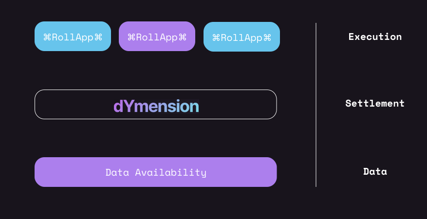

The traditional web model is composed of entities paying for segregated pieces of server. For example, when Twitter servers are under heavy use it does not affect Reddit servers. Similarly, dYmension applications receive a segregated high performant execution environment running the application. dYmension follows a modular blockchain architecture design that decouples different functions of a ‘Monolithic’ blockchain for greater performance and scalability.

**The functions that modular blockchains specialize in are:**

- Execution layer: Processes transactions
- Settlement layer: Dispute resolution, maintain state roots and bridge between environments
- Data availability layer: Ensures all data is made available when the block is proposed (no hidden transactions)

dYmension takes the unique approach of sharding the execution layer into application-specific rollups (RollApps). This design allows each application to have its own execution environment. The settlement layer of dYmension is termed "the Hub." The hub is a central place for security, liquidity and inter-operability. By implementing a settlement layer, dYmension is able to connect the ecosystem of RollApps with one another and the broader IBC-enabled world.

Sharding the execution layer into multiple distinct instances allows applications to be performance independant of the underlying base layers. Applications are able to run with significantly lower latency and higher throughput, while inheriting the security of the underlying base layers (settlement and data). Furthermore, dYmension utilizes various data availability solutions allowing [permissionless actors submit an proofs of fraudulent activity.](/docs/concepts/optimistic-rollups.md)

Depending on the design of the modular blockchain, consensus may be provided at various layers. dYmension utilizes the settlement layer to handle consensus of the RollApps, which enables a clean design for trust minimized bridging, handling any fraud disputes and a significant reduction in latency. This facilitates a highly scalable and efficient design that is capable of keeping up with modern day application requirenments.
